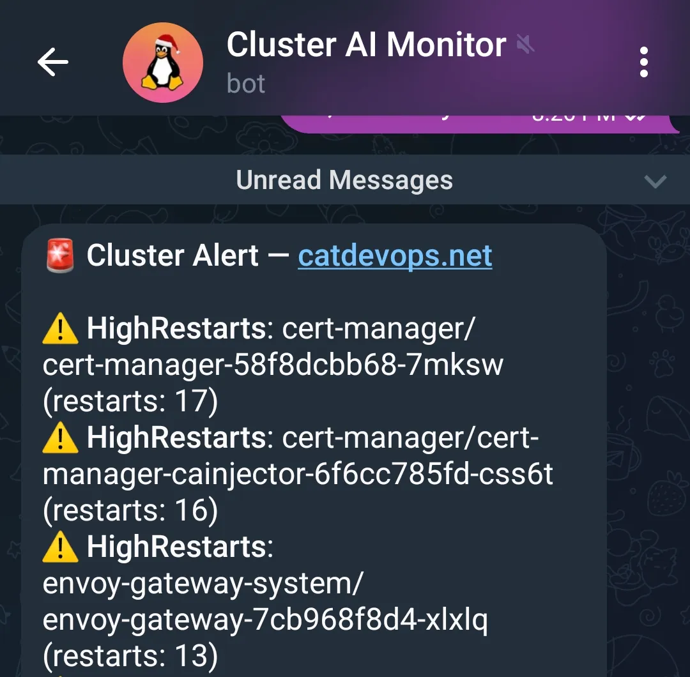
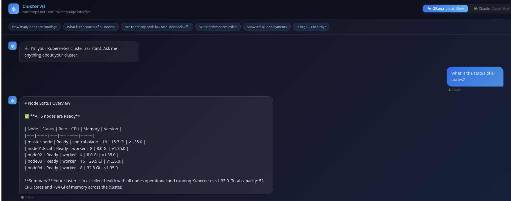
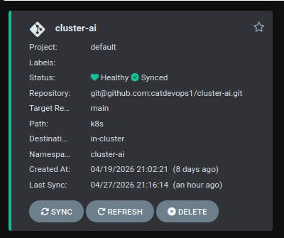

# Cluster AI 🤖⎈

A natural language Kubernetes cluster assistant running on bare-metal. Ask questions about your cluster in plain English and get real-time answers powered by **Claude** (cloud, fast) or **Ollama** (local, private).

**Live at:** `cluster-ai.catdevops.net`(private)

---

## Automated Cluster Monitoring & Telegram Alerts

In addition to the chat interface, Cluster AI runs a **background monitoring system** that watches your cluster 24/7 and sends you a Telegram message when something goes wrong — without you having to ask.

**How it works:**

A background scheduler (APScheduler) runs inside the FastAPI pod every 5 minutes:
1. Fetches live cluster state from the Kubernetes API
2. Detects issues — CrashLoopBackOff, NotReady nodes, deployments down, high restart counts
3. If issues are found → sends data to Claude
4. Claude generates a human-readable summary with actionable kubectl commands
5. Sends a Telegram message to your phone instantly

**Example alert:**

```
🚨 Cluster Alert 



❌ CrashLoopBackOff: cluster-ai/cluster-ai-api-xxx (restarts: 15)
⚠️ HighRestarts: job-track/job-track-backend (restarts: 47)

🤖 Claude says:
Your cluster-ai API pod is repeatedly crashing, likely due to a
misconfigured environment variable or application error. Check logs with:
kubectl logs -n cluster-ai deployment/cluster-ai-api --tail=50

— Cluster AI Monitor
```

**Spam protection** — once an issue is alerted, it won't alert again until the cluster recovers. You get one message per issue, not one every 5 minutes.

**What it detects:**
- Pods in `CrashLoopBackOff`
- Pods with restart count above threshold (default: 50)
- Nodes in `NotReady` state
- Deployments with 0 ready replicas

**Setup:**
1. Create a Telegram bot via `@BotFather`
2. Store `BOT_TOKEN` and `CHAT_ID` in Vault
3. Add to ExternalSecret — secrets are injected automatically
4. The scheduler starts automatically when the FastAPI pod starts

---

## What It Does

- Fetches **live cluster data** (nodes, pods, deployments, namespaces) from the Kubernetes API
- Sends that data as context to an LLM (Claude or Ollama)
- Returns human-readable answers with health indicators (✅ ⚠️ ❌)
- Blocks sensitive queries (secrets, tokens, credentials)

**Example questions:**
- "How many pods are running?"
- "What is the status of all nodes?"
- "Are there any pods in CrashLoopBackOff?"
- "Is ArgoCD healthy?"
- "Show me all deployments"

---

## Architecture

```
Browser (React UI)
    │
    ├── POST /api/ask { question, provider }
    │
FastAPI Backend (cluster-ai-api)
    │
    ├── Kubernetes API (via ServiceAccount) → live cluster data
    │
    ├── [provider=ollama] → Ollama pod (http://ollama:11434)
    │                         └── llama3.2:1b (local, free)
    │
    └── [provider=claude] → api.anthropic.com
                              └── claude-haiku-4-5-20251001

Background Monitor (APScheduler — every 5 minutes)
    │
    ├── Kubernetes API → detect issues
    ├── api.anthropic.com → Claude generates summary
    └── api.telegram.org → alert sent to your phone
```

---

## Stack

| Component | Technology |
|-----------|------------|
| Frontend | React + Vite |
| Backend | FastAPI (Python) |
| Monitoring | APScheduler (background scheduler) |
| Alerts | Telegram Bot API |
| Local LLM | Ollama (`llama3.2:1b`) |
| Cloud LLM | Anthropic Claude (`claude-haiku-4-5-20251001`) |
| Container Runtime | containerd |
| Orchestration | Kubernetes (bare-metal) |
| GitOps | ArgoCD (auto-sync) |
| Secrets | HashiCorp Vault + External Secrets Operator + AWS KMS |
| Ingress | Envoy Gateway + Cloudflare Tunnel |
| Storage | Longhorn (PVC for Ollama models) |
| Registry | GitHub Container Registry (ghcr.io) |

---

## Repository Structure

```
cluster-ai/
├── backend/
│   ├── main.py              # FastAPI app (Ollama + Claude routing)
│   ├── monitor.py           # Background scheduler (APScheduler + Telegram alerts)
│   ├── requirements.txt
│   └── Dockerfile
├── frontend/
│   ├── src/
│   │   ├── App.jsx          # React UI with Ollama/Claude provider toggle
│   │   └── main.jsx
│   ├── nginx.conf           # Reverse proxy to FastAPI
│   ├── Dockerfile
│   └── package.json
└── k8s/
    ├── namespace.yaml
    ├── fastapi.yaml         # cluster-ai-api Deployment
    ├── frontend.yaml        # cluster-ai-frontend Deployment
    ├── ollama.yaml          # Ollama Deployment (node04)
    ├── ollama-pull-job.yaml # Job to pull llama3.2:1b on deploy
    ├── rbac.yaml            # Read-only ClusterRole + binding
    ├── services.yaml
    ├── httproute.yaml       # Envoy Gateway HTTPRoute
    └── argocd-app.yaml
```

---

## Security

- **Read-only RBAC** — `cluster-ai-sa` ServiceAccount has `get`/`list` only on pods, nodes, deployments, namespaces, services. No secrets access.
- **Blocked queries** — requests containing `secret`, `token`, `password`, `credential`, `kubeconfig` are rejected with a friendly message before reaching the LLM.
- **API key management** — `ANTHROPIC_API_KEY` stored in HashiCorp Vault, synced to Kubernetes Secret via External Secrets Operator. Never hardcoded.
- **AWS KMS** — Vault auto-unseal uses AWS KMS. Master key never lives on the cluster.

---

## LLM Providers

### Ollama (Local)
- Model: `llama3.2:1b`
- Runs on `node04` (8 CPU, 32GB RAM)
- GPU: NVIDIA GTX 780M (CUDA 3.0 — too old for GPU inference, runs CPU-only)
- Response time: ~60 seconds
- Cost: Free

### Claude (Cloud)
- Model: `claude-haiku-4-5-20251001`
- Runs on Anthropic's infrastructure
- Response time: ~2-3 seconds
- Cost: ~$0.00025 per query (~20,000 queries per $5)

---

## Secrets Setup

API key stored in Vault:
```bash
k exec -it -n vault vault-0 -- vault kv put secret/cluster-ai/config \
  OLLAMA_URL="http://ollama.cluster-ai.svc.cluster.local:11434" \
  ANTHROPIC_API_KEY="sk-ant-..."
```

External Secret syncs to Kubernetes Secret automatically every hour.

Force immediate sync:
```bash
k annotate externalsecret cluster-ai-secret -n cluster-ai \
  force-sync=$(date +%s) --overwrite
```

---

## CI/CD

GitHub Actions builds and pushes Docker images to `ghcr.io/catdevops1/cluster-ai-*:latest` on every push to `main`. ArgoCD detects the Git change and syncs the manifests. Manual rollout required after image rebuild (using `latest` tag):

```bash
k rollout restart deployment/cluster-ai-api -n cluster-ai
k rollout restart deployment/cluster-ai-frontend -n cluster-ai
```

> **Known limitation:** ArgoCD does not auto-rollout on `latest` tag changes. Future improvement: use commit SHA tags.

---

## Local Development

```bash
# Port-forward to access UI locally
kubectl port-forward -n cluster-ai service/cluster-ai-frontend 8080:80 --address=0.0.0.0

# Access at
http://<node-ip>:8080
```

---

Most Kubernetes dashboards show you data — this one lets you ask questions about it. The goal was to explore how LLMs can be used as an interface layer over live infrastructure data rather than as a general-purpose chatbot.

The interesting engineering challenge: LLMs don't have access to your cluster. The solution is to fetch the cluster state on every request and inject it as context into the prompt — so every answer is based on what's actually running right now, not training data.

The dual-provider architecture (Ollama + Claude) came from a real constraint — the GPU in node04 turned out to have CUDA compute 3.0, too old for any modern inference framework. Ollama runs CPU-only at ~60 seconds per query. That pushed the Claude integration, which responds in ~2 seconds. Sometimes hardware limitations lead to better architecture decisions.

---

EKS / GKE / AKS?

Yes. The app uses the standard Kubernetes Python client which works on any conformant cluster. The monitoring and alerting system works on any Kubernetes distribution.

**What needs adapting per environment:**

| Component | Bare-Metal (this repo) | EKS | GKE | AKS |
|-----------|----------------------|-----|-----|-----|
| Secrets | Vault + ESO + AWS KMS | AWS Secrets Manager + ESO or Vault | GCP Secret Manager | Azure Key Vault |
| Auth | K8s ServiceAccount | IRSA (IAM Roles for Service Accounts) | Workload Identity | Managed Identity |
| Storage | Longhorn | EBS CSI Driver | Persistent Disk | Azure Disk |
| Ingress | Envoy Gateway + Cloudflare Tunnel | AWS ALB Ingress | GKE Ingress | AGIC |
| Load Balancer | MetalLB | AWS NLB/ALB | GCP LB | Azure LB |

**For EKS specifically:**
- Replace static AWS credentials with **IRSA** — attach an IAM role directly to the Kubernetes ServiceAccount, no secrets needed
- Use **AWS Secrets Manager** with ESO instead of self-hosted Vault
- GPU nodes (`g4dn.xlarge` or `p3.2xlarge`) will give Ollama real GPU acceleration since they run supported CUDA versions — unlike the GTX 780M in this homelab
- The monitoring/alerting system (APScheduler + Claude + Telegram) works out of the box with zero changes

**Production hardening checklist:**
- [ ] Replace `latest` image tags with commit SHA tags
- [ ] Add rate limiting (`slowapi`) to FastAPI
- [ ] Run 2+ API replicas with distributed scheduler lock (Redis) to avoid duplicate alerts
- [ ] Use IRSA instead of static credentials on EKS
- [ ] Set Anthropic monthly spend cap

The core FastAPI + React + monitoring architecture is production-grade and cloud-portable. The Kubernetes manifests in `k8s/` are the only thing that needs adapting per environment.

---

## Related Repos

- [`homelab-k8s-config-pub`](https://github.com/catdevops1/homelab-k8s-config-pub) — GitOps manifests (descheduler, external secrets, gateway, longhorn, vault)
- [`vault-config-pub`](https://github.com/catdevops1/vault-config-pub) — HashiCorp Vault + External Secrets Operator + AWS KMS auto-unseal
