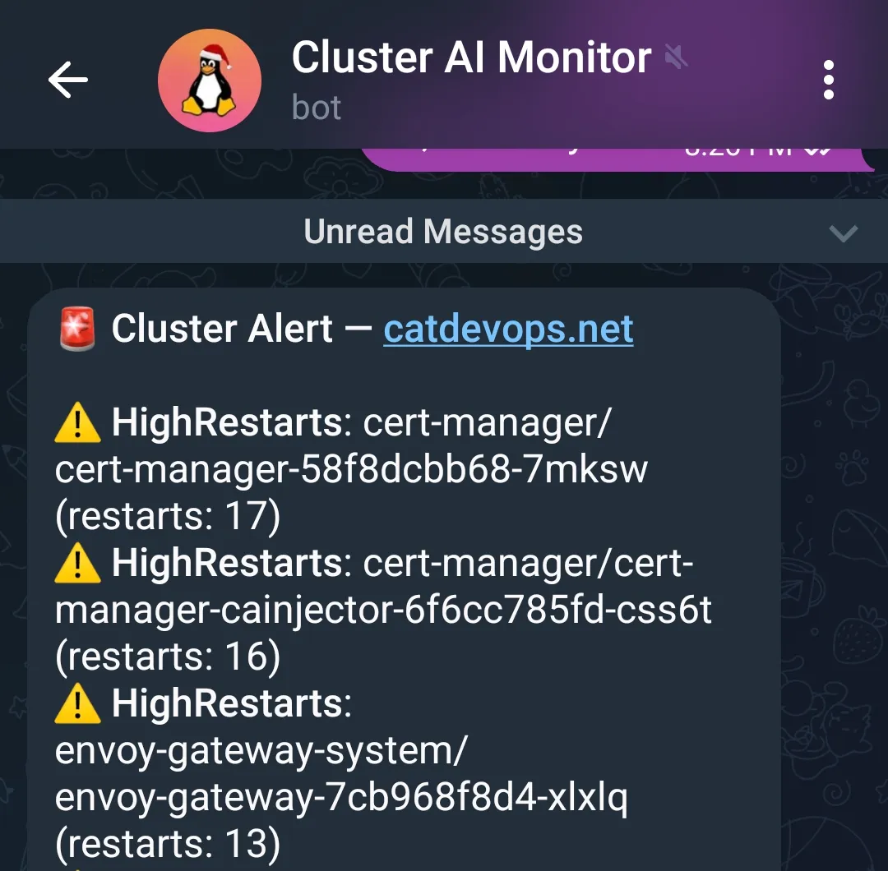
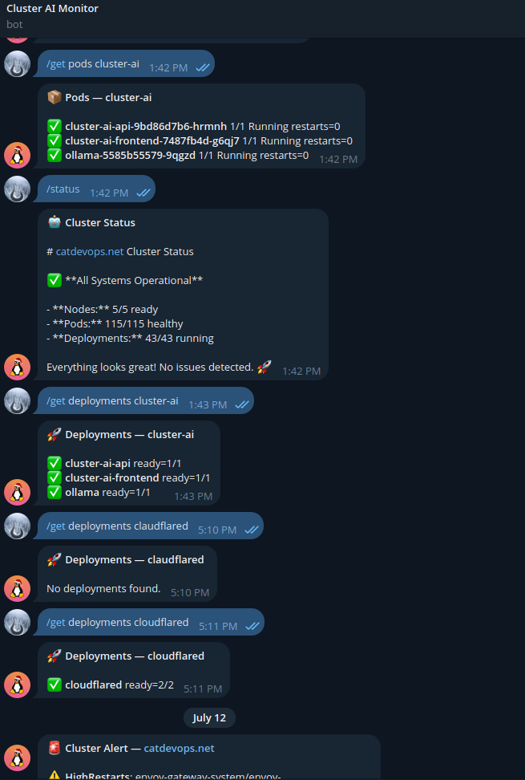
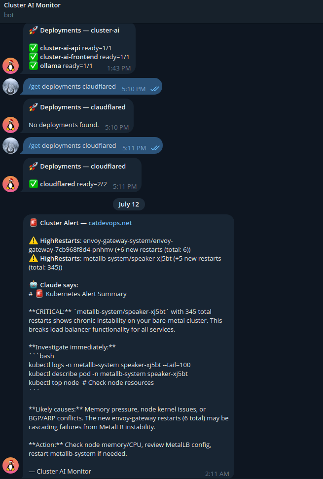
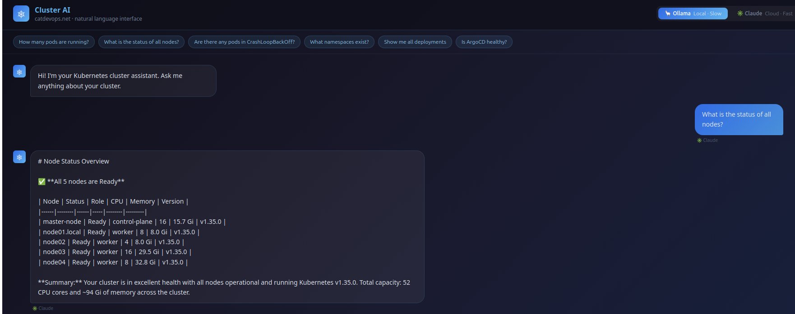
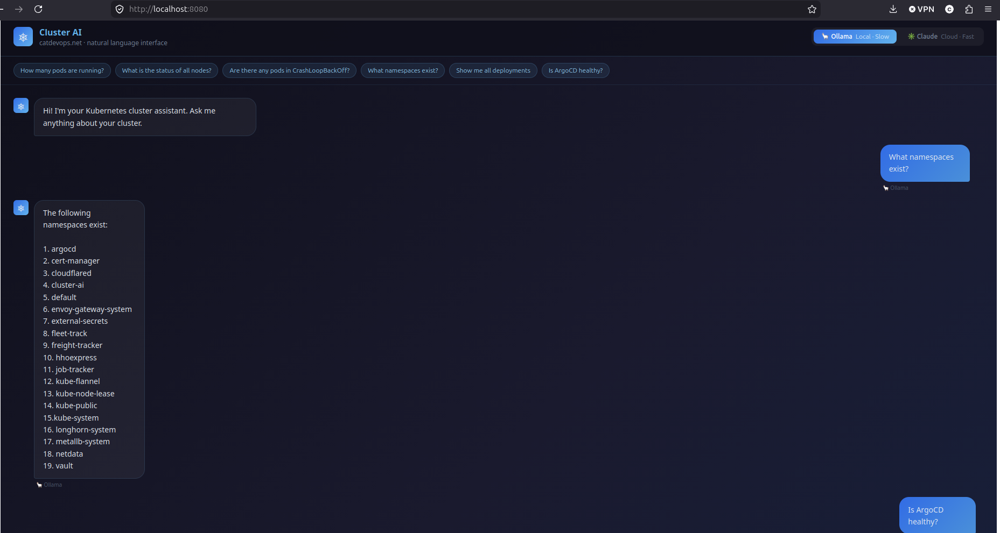
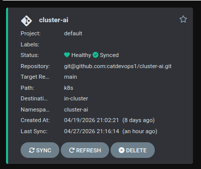

# Cluster AI 🤖⎈

A natural language Kubernetes cluster assistant and autonomous monitoring agent running on bare-metal. Ask questions about your cluster in plain English and get real-time answers powered by Claude (cloud, fast) or Ollama (local, private).

---
## Screenshots

### Autonomous Alerts (Telegram)


### Telegram Bot Commands


### Cluster Status & Deployments


### Web Interface (Claude)


### Web Interface (Ollama)


### ArgoCD Integration

---

## Autonomous Cluster Monitoring & Telegram Alerts

In addition to the chat interface, Cluster AI runs a background AI agent that watches your cluster 24/7 and sends a Telegram alert when something goes wrong — without you having to ask.

### How it works

A background scheduler (APScheduler) runs inside the FastAPI pod every 5 minutes:

1. Queries the Kubernetes API, cert-manager CRDs, Longhorn CRDs, ArgoCD CRDs, Vault health endpoint, and external HTTP endpoints
2. Detects issues across all layers — compute, storage, networking, secrets, certificates, GitOps
3. If new issues are found → sends data to Claude
4. Claude generates a concise runbook with actionable `kubectl` commands
5. Delivers a Telegram alert to your phone instantly

### Example alert

```
🚨 Cluster Alert — catdevops.net

❌ CrashLoopBackOff: cluster-ai/cluster-ai-api-xxx (restarts: 15)
⏰ CertExpiringSoon: fleet-track/fleet-track-tls (expires in 6 days)
🔴 LonghornVolumeDegraded: longhorn-system/pvc-abc123 (robustness=degraded)

🤖 Claude says:
Most critical: cluster-ai-api is crash looping. Check logs with:
kubectl logs -n cluster-ai deployment/cluster-ai-api --tail=50
kubectl describe pod -n cluster-ai -l app=cluster-ai-api
Likely cause: misconfigured environment variable or missing secret.

— Cluster AI Monitor
```

### What it detects

**Compute:**
- Pods in `CrashLoopBackOff` — alerted immediately
- Delta-based restart tracking — only alerts on **new** restarts in the last 5 minutes, ignores historical counts accumulated over cluster lifetime
- Deployments with 0 ready replicas
- Nodes in `NotReady`, `DiskPressure`, or `MemoryPressure` state

**Storage:**
- Longhorn volumes in `degraded` or `faulted` state

**Certificates:**
- cert-manager `Certificate` resources expiring within 14 days
- cert-manager certificates not in `Ready` state (renewal failed)

**Secrets:**
- Vault sealed — catches silent secret failures before apps break

**GitOps:**
- ArgoCD applications in `Degraded` health state
- ArgoCD applications `OutOfSync`

**End-to-end availability:**
- HTTP probes to all public endpoints via Cloudflare Tunnel — catches failures Kubernetes itself never sees (tunnel down, Envoy misconfiguration, SSL errors, app returning 5xx)

### Spam protection

- Delta-based restart tracking — historical restarts never trigger alerts
- `_alerted` set tracks active alerts — one message per issue, not one every 5 minutes
- Alert state clears automatically when the cluster fully recovers

### Setup

1. Create a Telegram bot via `@BotFather`
2. Store `TELEGRAM_BOT_TOKEN` and `TELEGRAM_CHAT_ID` in Vault
3. Add to ExternalSecret — secrets are injected automatically on deploy
4. The scheduler starts automatically when the FastAPI pod starts

---

## Telegram Bot Commands

In addition to receiving alerts, you can query your cluster directly from Telegram — no SSH, no terminal, no laptop needed.

A polling loop runs every 3 seconds inside the FastAPI pod, listening for commands from your configured `TELEGRAM_CHAT_ID`. All commands are **read-only** — no write access is exposed.

### Available commands

| Command | Description |
|---|---|
| `/get nodes` | List all nodes with status, roles, CPU, memory |
| `/get ns` | List all namespaces |
| `/get pods <namespace>` | List pods in a namespace with status and restart count |
| `/get pods all` | List all pods across all namespaces |
| `/get deployments <namespace>` | List deployments with ready/desired replica count |
| `/get deployments all` | List all deployments across all namespaces |
| `/get events <namespace>` | Show recent warning events in a namespace |
| `/logs <namespace> <pod>` | Fetch last 30 lines of pod logs |
| `/status` | Full cluster summary generated by Claude |
| `/alerts` | Show currently active alerts |
| `/help` | Show command reference |

### Example session

```
you: /get pods cluster-ai

bot: 📦 Pods — cluster-ai
✅ cluster-ai-api-9bd86d7b6-smt6c    1/1  Running  restarts=0
✅ cluster-ai-frontend-7487fb4d-8h5jc 1/1  Running  restarts=0
✅ ollama-5585b55579-js8xg            1/1  Running  restarts=0

you: /logs cluster-ai cluster-ai-api

bot: 📋 Logs — cluster-ai-api-9bd86d7b6-smt6c
INFO: Cluster monitor scheduler started
INFO: Application startup complete.
INFO: Running cluster health check...
INFO: Cluster healthy — no issues detected
...

you: /status

bot: 🤖 Cluster Status
✅ All Systems Green
- Nodes: 5/5 ready and operational
- Pods: 114/114 healthy and running
- Deployments: 42/42 up and serving traffic
```

### Security

- Commands are only accepted from the configured `TELEGRAM_CHAT_ID` — no other user can query your cluster
- All K8s calls are read-only via `cluster-ai-sa` ServiceAccount
- No `kubectl exec`, `delete`, `apply`, or any mutating operations are exposed

---

## Chat Interface

Ask questions about your cluster in plain English:

- "How many pods are running?"
- "What is the status of all nodes?"
- "Are there any pods in CrashLoopBackOff?"
- "Is ArgoCD healthy?"
- "Show me all deployments in the fleet-track namespace"

Answers are based on **live cluster data fetched on every request** — not training data.

---

## Architecture

```
Browser (React UI)
    │
    ├── POST /api/ask { question, provider }
    │
FastAPI Backend (cluster-ai-api)
    │
    ├── Kubernetes API (via ServiceAccount) → live cluster data
    │
    ├── [provider=ollama] → Ollama pod (http://ollama:11434)
    │                         └── llama3.2:1b (local, private)
    │
    └── [provider=claude] → api.anthropic.com
                              └── claude-haiku-4-5-20251001

Background Monitor (APScheduler — every 5 minutes)
    │
    ├── Kubernetes API      → pods, nodes, deployments
    ├── cert-manager CRDs   → certificate expiry
    ├── Longhorn CRDs       → volume health
    ├── ArgoCD CRDs         → application sync/health
    ├── Vault /v1/sys/health → sealed check
    ├── External HTTP probes → end-to-end availability
    ├── api.anthropic.com   → Claude generates runbook
    └── api.telegram.org    → alert sent to phone

Telegram Bot (APScheduler — every 3 seconds)
    │
    ├── getUpdates (long poll) → receives commands
    ├── Kubernetes API         → executes read-only queries
    ├── api.anthropic.com      → /status summary via Claude
    └── api.telegram.org       → sends response

GitOps: ArgoCD auto-syncs all manifests from this repo
Secrets: HashiCorp Vault → ESO → Kubernetes Secret
```

---

## Stack

| Component | Technology |
|---|---|
| Frontend | React + Vite |
| Backend | FastAPI (Python) |
| Monitoring | APScheduler (5-min interval) |
| Telegram Bot | APScheduler (3-sec poll interval) |
| Alerts | Telegram Bot API |
| AI — Cloud | Anthropic Claude (claude-haiku-4-5-20251001) |
| AI — Local | Ollama (llama3.2:1b) |
| Container Runtime | containerd |
| Orchestration | Kubernetes (bare-metal, 5 nodes) |
| GitOps | ArgoCD (auto-sync) |
| Secrets | HashiCorp Vault + External Secrets Operator + AWS KMS auto-unseal |
| Ingress | Envoy Gateway + Cloudflare Tunnel (zero open ports) |
| Storage | Longhorn (distributed block storage) |
| Registry | GitHub Container Registry (ghcr.io) |

---

## Repository Structure

```
cluster-ai/
├── backend/
│   ├── main.py              # FastAPI app (chat interface, Ollama + Claude routing)
│   ├── monitor.py           # Background monitor (APScheduler + all health checks + Telegram alerts)
│   ├── telegram_bot.py      # Telegram bot command interface (polling + command handlers)
│   ├── requirements.txt
│   └── Dockerfile
├── frontend/
│   ├── src/
│   │   ├── App.jsx          # React UI with Ollama/Claude provider toggle
│   │   └── main.jsx
│   ├── nginx.conf           # Reverse proxy to FastAPI
│   ├── Dockerfile
│   └── package.json
└── k8s/
    ├── namespace.yaml
    ├── fastapi.yaml         # cluster-ai-api Deployment
    ├── frontend.yaml        # cluster-ai-frontend Deployment
    ├── ollama.yaml          # Ollama Deployment (node04)
    ├── ollama-pull-job.yaml # Job to pull llama3.2:1b on deploy
    ├── rbac.yaml            # Read-only ClusterRole (pods, nodes, certs, volumes, apps)
    ├── services.yaml
    ├── httproute.yaml       # Envoy Gateway HTTPRoute
    └── argocd-app.yaml
```

---

## Security

- **Read-only RBAC** — `cluster-ai-sa` ServiceAccount has `get/list/watch` only. No write access, no secrets access.
- **RBAC scope** — covers core resources, cert-manager CRDs, Longhorn CRDs, ArgoCD CRDs, metrics. Explicitly no access to `secrets` resource.
- **Blocked queries** — requests containing `secret`, `token`, `password`, `credential`, `kubeconfig` are rejected before reaching the LLM.
- **Telegram auth** — bot only responds to the configured `TELEGRAM_CHAT_ID`. All other senders are silently ignored.
- **API key management** — `ANTHROPIC_API_KEY`, `TELEGRAM_BOT_TOKEN` stored in HashiCorp Vault, synced to Kubernetes Secret via External Secrets Operator. Never hardcoded.
- **AWS KMS** — Vault auto-unseal uses AWS KMS. Master key never lives on the cluster.
- **Zero open ports** — all ingress via Cloudflare Tunnel. No NodePort, no LoadBalancer exposed to internet.

---

## LLM Providers

### Ollama (Local)
- Model: `llama3.2:1b`
- Runs on node04 (8 CPU, 32GB RAM)
- GPU: NVIDIA GTX 780M (CUDA 3.0 — too old for GPU inference, runs CPU-only)
- Response time: ~60 seconds
- Cost: Free — zero data leaves the cluster

### Claude (Cloud)
- Model: `claude-haiku-4-5-20251001`
- Runs on Anthropic's infrastructure
- Response time: ~2-3 seconds
- Cost: ~$0.00025 per query (~20,000 queries per $5)

---

## Secrets Setup

```bash
# Store secrets in Vault
kubectl exec -it -n vault vault-0 -- vault kv put secret/cluster-ai/config \
  OLLAMA_URL="http://ollama.cluster-ai.svc.cluster.local:11434" \
  ANTHROPIC_API_KEY="sk-ant-..." \
  TELEGRAM_BOT_TOKEN="..." \
  TELEGRAM_CHAT_ID="..."

# Force immediate ESO sync
kubectl annotate externalsecret cluster-ai-secret -n cluster-ai \
  force-sync=$(date +%s) --overwrite
```

---

## CI/CD

GitHub Actions builds and pushes Docker images to `ghcr.io/catdevops1/cluster-ai-*:latest` on every push to `main`. ArgoCD detects the Git change and syncs the manifests. Manual rollout required after image rebuild (using `latest` tag):

```bash
kubectl rollout restart deployment/cluster-ai-api -n cluster-ai
kubectl rollout restart deployment/cluster-ai-frontend -n cluster-ai
```

> **Known limitation:** ArgoCD does not auto-rollout on `latest` tag changes. Planned improvement: switch to commit SHA tags for fully automated rollouts.

---

## Local Development

```bash
# Port-forward to access UI locally
kubectl port-forward -n cluster-ai service/cluster-ai-frontend 8080:80 --address=0.0.0.0

# Access at
http://<node-ip>:8080
```

---

## Design Notes

Most Kubernetes dashboards show you data — this one contacts you when something breaks and tells you what to do about it.

**The core engineering problem:** LLMs don't have access to your cluster. The solution is to fetch live cluster state on every request and inject it as context into the prompt — so every answer is based on what's actually running right now, not training data.

**Why delta-based restart tracking matters:** A cluster running for 200+ days accumulates hundreds of cumulative restarts across system pods (metallb speakers, longhorn managers, kube-scheduler). A static threshold like "alert if restarts > 50" produces constant noise. Delta tracking — alert only if a pod gained 3+ new restarts in the last 5 minutes — eliminates all historical noise and only fires on real incidents.

**Why the Telegram bot matters:** Alerts tell you something is wrong. The bot lets you diagnose it from your phone without opening a laptop. `/logs`, `/get pods`, and `/status` cover 90% of first-response triage — the full incident loop from detection to diagnosis happens in Telegram.

**The dual-provider architecture** came from a real hardware constraint — the GPU in node04 has CUDA compute 3.0, too old for any modern inference framework. Ollama runs CPU-only at ~60 seconds per query. That pushed the Claude integration. Sometimes hardware limitations lead to better architecture decisions.

**Why asyncio.to_thread() matters:** The Kubernetes Python client is synchronous. Running sync K8s calls directly inside an `AsyncIOScheduler` job blocks the entire asyncio event loop — starving FastAPI health probes and causing the pod to be marked unhealthy by kubelet. Wrapping all sync K8s calls in `asyncio.to_thread()` moves them to a thread pool, keeping the event loop free.

---

## Cloud Portability (EKS / GKE / AKS)

The app uses the standard Kubernetes Python client — works on any conformant cluster. The monitoring and alerting system is cluster-distribution agnostic.

| Component | Bare-Metal (this repo) | EKS | GKE | AKS |
|---|---|---|---|---|
| Secrets | Vault + ESO + AWS KMS | AWS Secrets Manager + ESO | GCP Secret Manager | Azure Key Vault |
| Auth | K8s ServiceAccount | IRSA | Workload Identity | Managed Identity |
| Storage | Longhorn | EBS CSI Driver | Persistent Disk | Azure Disk |
| Ingress | Envoy Gateway + Cloudflare Tunnel | AWS ALB | GKE Ingress | AGIC |
| Load Balancer | MetalLB | AWS NLB/ALB | GCP LB | Azure LB |

---

## Production Hardening Checklist

- [ ] Replace `latest` image tags with commit SHA tags for fully automated rollouts
- [ ] Add rate limiting (`slowapi`) to FastAPI endpoints
- [ ] Run 2+ API replicas with distributed scheduler lock (Redis) to avoid duplicate alerts
- [ ] Use IRSA instead of static credentials on EKS
- [ ] Set Anthropic monthly spend cap
- [ ] Add Telegram message truncation (4096 char hard limit)
- [ ] Persist `_restart_snapshot` to ConfigMap for monitor resilience across pod restarts
- [ ] Add `pods/log` to ClusterRole for cross-namespace `/logs` bot command support

---

## Related Repos

- [homelab-k8s-config-pub](https://github.com/catdevops1/homelab-k8s-config-pub) — GitOps manifests (descheduler, external secrets, gateway, longhorn, vault)
- [vault-config-pub](https://github.com/catdevops1/vault-config-pub) — HashiCorp Vault + External Secrets Operator + AWS KMS auto-unseal
